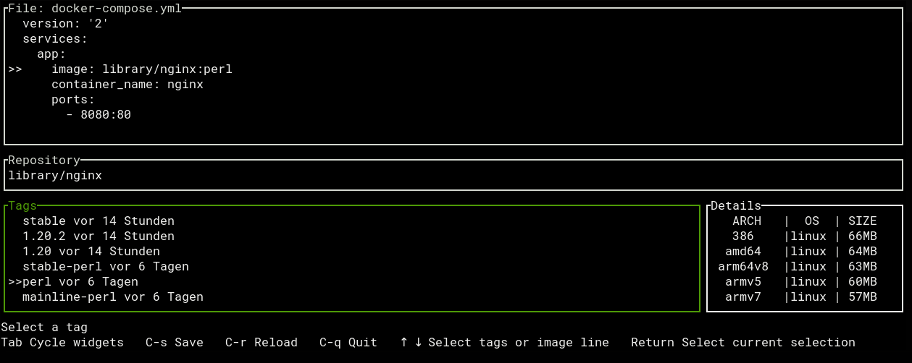

# reel-moby

search for new docker tags and update them in your docker-compose file

## Usage

Searches the current folder for a docker-compose.(yml|yaml) file and opens it when it found one. Then it is possible to select a image line. The program then shows the found repository and shows the latest tags. The tags can be scrolled and selected, which updates the opened file.
From that point save the file and pull the new image with `docker-compose up -d` or `docker-compse pull`.

